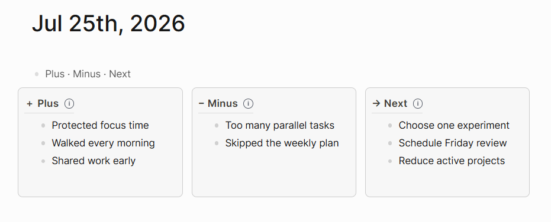

# Plus Minus Next for Logseq

A simple three-column reflection board for Logseq, based on the
**Plus / Minus / Next** method:

- **Plus** — What worked well and should be repeated?
- **Minus** — What caused friction or did not work?
- **Next** — What will you change, try, or prioritise next?

The plugin presents these prompts from left to right while keeping every entry
as a normal Logseq block.

## Usage

1. Edit a block and type `/Plus Minus Next`.
2. Choose **Plus Minus Next: Insert reflection board**.
3. Add your reflections in Plus, Minus, and Next.

In file graphs, hover over the small information icon beside a heading to see
its reflection prompt.

## Features

- Three dedicated Plus, Minus and Next columns
- Automatically growing column height
- Compatible with both DB and file graphs
- Board is stored as an ordinary Logseq outline with a special representation,
  so its data remains readable and editable if the plugin is disabled or
  removed.
- No network requests

## Project

See [CHANGELOG.md](CHANGELOG.md) for release notes and
[CONTRIBUTING.md](CONTRIBUTING.md) for contribution guidance.

## Support

If you like this plugin, you can support me here:

